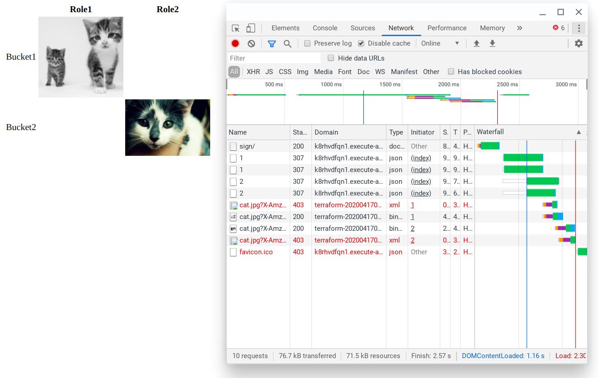

# Example code for how to use least privilege with signed URLs

## How to use

* ```terraform init```
* ```terraform apply```
* navigate to the url
* ```terraform destroy```

## What it does

It creates 2 buckets and 2 roles, along with a Lambda function behind an API Gateway. In both buckets, there is a different cat.jpg file.

Role1 can read bucket1 only and role2 can read bucket2 only.

The Lambda execution role can assume both, but can not read any of the buckets.

When the browser requests the image, the Lambda assumes one of the roles and signs the URL. On the example page, there is a test case for all 4 possible combinations: role1-bucket1, role1-bucket2, role2-bucket1, role2-bucket2.

Opening the page shows that only the role1-bucket1 and the role2-bucket2 combinations work. This shows that using a separate role (and not the execution role of the function) can achieve least privilege.

Here's how it looks:



The images are from  [https://thecatapi.com/](https://thecatapi.com/)
